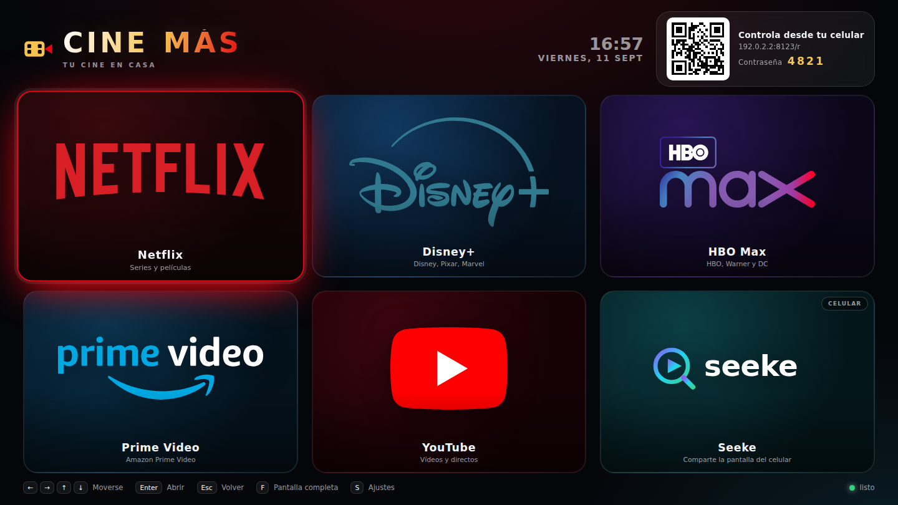

# CINE-MÁS

Selector de plataformas de películas para el cine de casa. Se abre en el televisor,
se controla desde el celular escaneando un código QR y permite mandar la pantalla
del celular a la tele con **Seeke**.



## Qué hace

- **Seis plataformas** con su logo: Netflix, Disney+, HBO Max, Prime Video, YouTube y Seeke.
- Las cinco primeras **abren su página oficial**.
- **Seeke** muestra un código QR: al escanearlo con el celular puedes **compartir la
  pantalla o la cámara** del teléfono en el televisor, o **enviar un enlace** para que
  la tele lo abra.
- En la esquina superior hay otro **código QR con la contraseña** para manejar el menú
  desde el celular: flechas, OK, atrás, inicio y acceso directo a cada plataforma.
- No necesita internet para funcionar (solo para abrir las plataformas) ni instalar nada:
  **no tiene dependencias**, solo Node.js.

## Dónde abrirlo

Hay tres formas, de la más cómoda a la más completa.

### 1. La web publicada (nada que instalar)

- **Con control desde el celular:**
  <https://claude.ai/code/artifact/b341cf93-9cd5-49a3-8a52-9b82c8b7b4c9>
- **Pública, sin cuenta y sin control por celular:**
  <https://fwaldbaum.github.io/Cine-mas/>

La primera es la completa de las dos.

Se abre en cualquier PC o laptop conectado al televisor. Tiene el menú completo con
sus logos, el reloj, los ajustes y el código QR para manejarla desde el celular: el
teléfono abre el mismo enlace, se reconoce solo como mando y pide la contraseña que
sale en la tele.

Dos cosas que solo existen en la versión que corre en tu equipo:

- **Duplicar la pantalla del celular** en la tele. En la web, Seeke sirve para mandar
  un enlace y que el televisor lo abra.
- Abrir una plataforma **desde el celular sin tocar el PC**. El navegador solo abre
  páginas nuevas cuando la orden sale del propio equipo. Para saltarse eso, entra una
  vez en *Ajustes → Activar modo cine*: CINE-MÁS se queda con una pestaña abierta y
  luego el celular puede cambiarla de plataforma sin que te levantes.

### 2. En tu equipo, con doble clic

Descarga el proyecto y abre el archivo que corresponda a tu sistema:

| Sistema | Archivo |
| --- | --- |
| Windows | `INICIAR-CINE-MAS.bat` |
| macOS | `iniciar-cine-mas.command` |
| Linux | `iniciar-cine-mas.sh` |

Arranca el servidor y abre el navegador solo. Así funciona **todo**: el control por QR
y Seeke duplicando la pantalla del celular en el televisor.

### 3. Desde la terminal

```bash
node server.js
```

Al arrancar verás algo así:

```
  Televisor .......... http://localhost:8123/
  Control remoto ..... http://192.168.1.50:8123/r
  Compartir pantalla . https://192.168.1.50:8443/s
  Contraseña ......... 4821
```

1. En el equipo conectado al televisor abre **http://localhost:8123/** y ponlo a
   pantalla completa con la tecla `F`.
2. Con el celular en el **mismo wifi**, escanea el QR de arriba a la derecha.
3. Escribe en el celular la **contraseña** que aparece en la tele. Listo.

### Teclas del televisor

| Tecla | Acción |
| --- | --- |
| `←` `→` `↑` `↓` | Moverse por el menú |
| `Enter` | Abrir la plataforma seleccionada |
| `Esc` | Volver |
| `F` | Pantalla completa |
| `S` | Ajustes |

## Seeke: mandar el celular a la tele

Al elegir Seeke, el televisor muestra un código QR grande. Con el celular:

1. Escanea el QR.
2. El navegador avisará de que el certificado **no es de confianza**: es normal, el
   certificado lo genera tu propio equipo. Toca *Avanzado → Continuar*.
3. Elige una de las tres opciones:
   - **Compartir pantalla**: todo lo que veas en el celular se ve en la tele.
   - **Compartir cámara**: manda la cámara del celular.
   - **Abrir en la tele**: pega la dirección de Seeke y se abre en el televisor.

El vídeo va **directo del celular a la tele** por WebRTC dentro de tu red; no pasa
por ningún servidor de internet.

> Compartir la pantalla completa solo lo permiten algunos navegadores. En iPhone y en
> muchos Android esa opción está bloqueada por el sistema: en ese caso usa la cámara o
> manda el enlace. El botón se desactiva solo y te lo explica en pantalla.

## Ajustes útiles

Se configuran con variables de entorno al arrancar:

| Variable | Para qué sirve |
| --- | --- |
| `CINEMAS_PORT` | Puerto de la web (por defecto 8123) |
| `CINEMAS_HTTPS_PORT` | Puerto seguro para compartir pantalla (8443) |
| `CINEMAS_HTTPS=0` | Arrancar sin HTTPS |
| `CINEMAS_PIN` | Fijar una contraseña en vez de una al azar |
| `CINEMAS_TV_HOSTS` | Equipos autorizados a mostrar la pantalla del televisor |

Ejemplo: `CINEMAS_PIN=1234 CINEMAS_PORT=8000 node server.js`

### Si el televisor no es el mismo equipo que el servidor

Por seguridad, la pantalla del televisor (la que enseña la contraseña) solo se abre
desde el propio equipo. Si quieres abrirla en un smart TV o en otro computador de la
casa, arranca así:

```bash
CINEMAS_TV_HOSTS=192.168.1.60 node server.js   # solo ese equipo
CINEMAS_TV_HOSTS='*' node server.js            # cualquier equipo de tu red
```

### El sitio de GitHub Pages

<https://fwaldbaum.github.io/Cine-mas/>

GitHub publica el repositorio tal cual, así que la raíz te lleva al menú y el archivo
`.nojekyll` evita que GitHub intente convertirlo en un blog. Ese sitio funciona en
**modo web**: menú, teclado y ratón, sin control por celular, porque en un hosting
estático no hay servidor detrás. La propia página lo avisa y explica cómo recuperar
el mando.

El flujo `.github/workflows/pages.yml` queda a mano (*Actions → Run workflow*) por si
algún día prefieres cambiar el origen de Pages a *GitHub Actions* y publicar solo la
carpeta `public/`.

### Cambiar las direcciones de las plataformas

Están en `public/js/platforms.js`, en el campo `url` de cada una. Ahí también puedes
cambiar el nombre, el logo o el color de cada tarjeta.

### Pantalla completa

El botón *Pantalla* del celular solo funciona si el navegador del televisor lo permite.
Casi todos exigen que la orden salga del propio equipo, así que lo seguro es pulsar la
tecla `F` en el teclado del cine. Si el navegador la rechaza, la tele lo avisa en pantalla.

### Ventanas emergentes

Al elegir una plataforma, CINE-MÁS intenta abrirla en una ventana nueva para seguir
vivo por detrás; así puedes volver al menú desde el celular con *Cerrar y volver*.
Permite las ventanas emergentes para esta página en tu navegador. Si están bloqueadas,
la plataforma se abre en la misma pestaña y se vuelve con el botón *Atrás*.

## Seguridad

Pensado para una red doméstica:

- El control remoto pide una **contraseña de 4 cifras** que solo se ve en el televisor,
  con bloqueo temporal tras 5 intentos fallidos.
- La página de Seeke necesita un **código de un solo uso** que viaja dentro del QR y se
  puede cambiar desde la tele.
- La contraseña nunca se envía a equipos de la red que no sean el televisor.
- El certificado HTTPS se genera solo la primera vez y se guarda en `.certs/`
  (esa carpeta no se sube al repositorio).

No lo publiques en internet: está hecho para el wifi de casa.

## Cómo está montado

```
server.js              servidor web + WebSocket + señalización WebRTC
web/artefacto.html     versión publicada como página, con mando en vivo
lib/ws.js              servidor WebSocket propio (sin dependencias)
lib/selfsigned.js      certificado HTTPS autofirmado hecho en Node puro
public/index.html      pantalla del televisor
public/remote.html     control remoto del celular
public/share.html      pantalla de Seeke para compartir
public/js/qr.js        generador de códigos QR propio (sin dependencias)
public/js/platforms.js lista de plataformas
public/img/            logos
```

Requiere Node.js 18 o superior. Los logos son marcas registradas de sus dueños y se
usan solo para identificar cada servicio.
